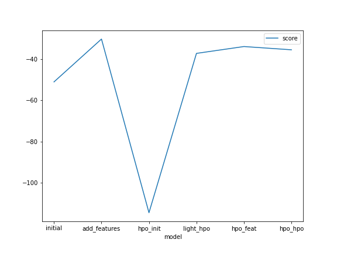
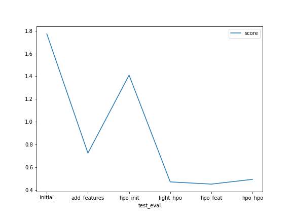

# Report: Predict Bike Sharing Demand with AutoGluon Solution

#### MARK AWUKU

## Initial Training

### What did you realize when you tried to submit your predictions? What changes were needed to the output of the predictor to submit your results?

Kaggle rejects the submission, in order to resolve issue I set every value below 0 in the series to 0 using the command `data_series[value < 0] = 0`

### What was the top ranked model that performed?

WeightedEnsemble_L3

## Exploratory data analysis and feature creation

### What did the exploratory analysis find and how did you add additional features?

EDA shows similar volume of rentals across all four seasons. More rentals were recorded when the `temp` and `atemp` were between 20 and 30 degree Celsius averagely more when the `temperature` felt around 25 degree Celsius. This indicates people prefer to rent when the day is warm and suitable to when it's ver low or too high.

EDA shows rentals are high on non-holidays compare to hoildays. Similarly it shows rental is high on week days according to the plot on `workingday` probably indicating more workers using bikes as source to commute to work. Data shows high number of rentals when the whether is _clear with few clouds or partly cloudy_. Rental numbers decrease when the whether is _mist and cloudy(broken)_. The rental numbers decrease when is _light snow or light rain with thunderstorm or scattered clouds_. During heavy rains, no rental is recorded.

Humidity averagely around 50-60 and windspeed between 5-10 recorded high rentals respectively.

To add additional features, I extracted the year, month, day, & hour data from the datatime feature, making 4 additional features added to the train and test data.

### How much better did your model preform after adding additional features and why do you think that is?

All models hyperparameters were set to defaults yet models performance almost doubled after feature engineering and this could be a results of models being exposed to more patterns from the hours, days, months, & years of rentals.

## Hyper parameter tuning

### How much better did your model preform after trying different hyper parameters?

Performance slightly decreased probably due ineffective hyperparameters tuning.

### If you were given more time with this dataset, where do you think you would spend more time?

More time will be spent on the following;

- Categozing the `hours` into _morning_ 7-9am, _lunch_ time 11-1pm and _evening_ rush hour between 5-6pm
- Categozring the `temp` into _hot cold and mild_

### Create a table with the models you ran, the hyperparameters modified, and the kaggle score.

| model        | hpo1                                      | hpo2                          | hpo3                                         | score   |
| ------------ | ----------------------------------------- | ----------------------------- | -------------------------------------------- | ------- |
| initial      | num_leaves                                | iterations                    | learning_rate                                | 1.40947 |
| add_features | num_leaves                                | iterations                    | learning_rate                                | 0.45144 |
| hpo          | num_leaves, num_boost_round, tree_learner | iterations, depth, num_epochs | learning_rate, dropout_prob, random_strength | 0.49312 |

### Create a line plot showing the top model score for the three (or more) training runs during the project.

### Create a line plot showing the top kaggle score for the three (or more) prediction submissions during the project.

## Summary

Initial model run used the raw data ignoring the casual and registered columns during the training. Three hyperparameters were tuned in all from `num_leaves` of LightGBM, `iterations` of CatBoost & `learning_rate` of NeuralNet. The top performaningmodels were the _`WeightedEnsemble_L3`_ followered by _`CatBoost_BAG_L2`_ with score_val of `-114.598932` & `-114.981646` respectively. The submitted predictions received a score of `1.40947` which was better compared to the initial run without any hyperparameter tuning.

The second run, model was exposed to additional features revealing the `hour`, `day`, `month` and `year` of rentals. Model was tuned using the same hyperparameter from the _initial run_ and the submitted predictions scored `0.45144` on kaggle. Top 2 performing models were _`WeightedEnsemble_L3`_ & _`WeightedEnsemble_L2`_ scoring `-33.831518` & `-33.888932`. Model exposure to the 4 new features revealed meaning patterns about the hours, days, month & years rentals are most active.

The last run was based on tuning more hyperparameters in addition to the initial ones tuned. Model was still exposed to the 4 new features. Each algorithm Light GBM, CatBoost, XGBoost, RandomForest and NeuralNet was lightly tuned. Top model performed slighlt less with score_val of `-35.414700` compared to the previous run `-33.831518`. Kaggle score slighest reduced to `0.49312`. The additionals hyperparameters added where basically tuned without much focus on regulariztion methods and techniques to prevent to models overfitting.
